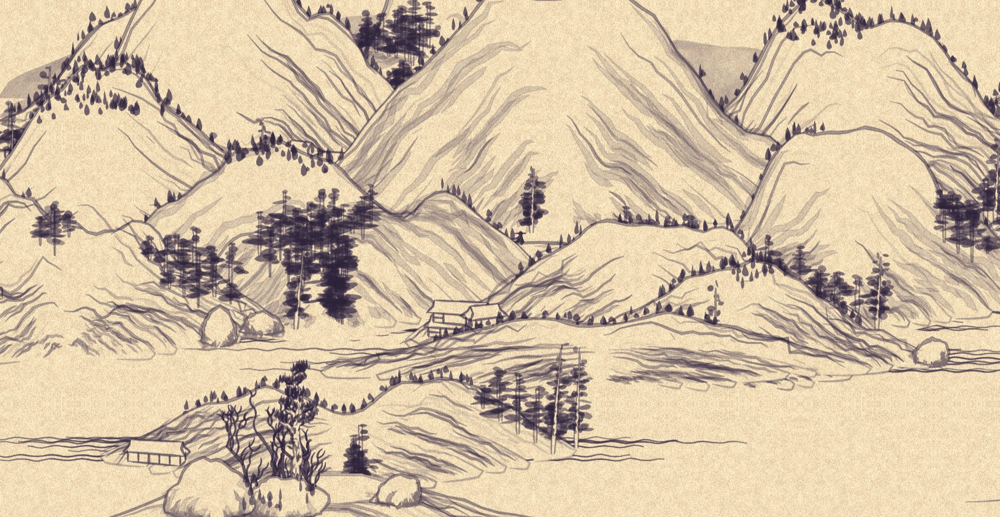

# shanshui-bg

An endless Chinese ink landscape that scrolls slowly across your desktop, as a **KDE Plasma
wallpaper** or as a **website background**.




https://github.com/user-attachments/assets/edd8e97f-22ae-4e33-ad2f-fb69a2f01681


**The landscape is [{Shan, Shui}\*](https://github.com/LingDong-/shan-shui-inf) by
[Lingdong Huang](https://github.com/LingDong-)** (MIT, 2018): a procedurally generated, infinitely
scrolling Chinese landscape painting. All the painting is Lingdong Huang's work, and the generator
runs here unmodified. This project only makes it move on its own, cheaply enough to leave running
all day. See [CREDITS.md](CREDITS.md).

This is an unofficial project, not affiliated with Lingdong Huang.

## Features

- Endless, never-repeating scroll, with a new landscape at each start (or a fixed seed).
- Smooth at slow speeds: scrolling runs on the compositor, and the landscape is drawn larger than
  the screen with a gentle vertical drift that changes direction now and then.
- Ink colour, ink strength, paper tone, paper grain and a night (inverted) mode.
- Light on resources. As the KDE wallpaper on a 1920×1080 screen: about 2% of one CPU core for the
  page, and about 260 MB of memory.
- The upstream generator is diff-tested against the original for byte-identical output.

## KDE Plasma wallpaper

Tested on **Plasma 5.27 (X11)**. Plasma 6 isn't supported yet (it needs a Qt 6 port of the small QML
part); help testing a port is welcome.

Requirements: Node.js (to build), `kpackagetool5`, and the QtWebEngine QML module for Qt 5 (on
Debian/Ubuntu: `qml-module-qtwebengine`).

```sh
git clone https://github.com/chrisfoulon/shanshui-bg
cd shanshui-bg
kde/install.sh        # builds the page and installs the wallpaper for your user
```

Then right-click the desktop → **Configure Desktop and Wallpaper** → Wallpaper type **Shan Shui**.

**Settings:** the wallpaper takes a settings link from the demo (below). Tune the look in the demo's
panel, copy its link, and paste it into the wallpaper's settings field. Leave the field empty for the
defaults. Remove `seed=` from the link to get a new landscape at each login.

To update, pull and run `kde/install.sh` again. To remove:
`kpackagetool5 -t Plasma/Wallpaper -r org.shanshui.wallpaper`.

## Demo

```sh
node bench/serve.mjs  # Node 20.11 or later
```

Open <http://127.0.0.1:8765/demo/>. Press **P** (or the ⚙ button) for the settings panel, with
Motion and Style tabs and presets. Every setting is kept in the URL.

## Website background

Copy `core/` to your site and start the scroller on an element:

```html
<div id="landscape" style="position: fixed; inset: 0; z-index: -1"></div>
<script type="module">
  import { startScroller } from "./core/scroller.js";
  startScroller(document.getElementById("landscape"), { speed: 20 });
</script>
```

It must be served over HTTP(S), not opened as a file, because it runs a module worker. It pauses
while the tab is hidden, and shows a still landscape to visitors who ask for reduced motion. Please
keep a visible credit to Lingdong Huang, as the demo does in its corner.

Options (all optional):

| option | default | |
|---|---|---|
| `seed` | random | string; the same seed gives the same landscape |
| `speed` | 20 | CSS px per second |
| `zoom` | 1.5 | landscape height as a multiple of the element height |
| `drift` | 20 | vertical drift, CSS px per second (0 = off) |
| `turn` | 20 | mean seconds between drift direction changes |
| `ink` | `"#110349"` | ink colour; `null` = the original grey ink |
| `inkStrength` | 2 | 1 = original; lower is lighter, higher is darker (up to 2) |
| `paper` | `"#f7deb8"` | paper tone; `null` = the original |
| `grain` | 3 | paper texture amount (1 = original) |
| `night` | false | invert: dark paper, light ink |
| `still` | reduced-motion setting | `true` shows a still landscape |
| `motion` | `"smooth"` | `"step"` moves in whole device pixels (cheaper, but steps show at slow speeds) |
| `soften`, `supersample` | 0, 1 | anti-shimmer filters for thin lines; see `core/scroller.js` |

`UPSTREAM_STYLE` (exported) gives the original colours back:
`startScroller(el, { ...UPSTREAM_STYLE })`.

`startScroller` returns `{ pause(), play(), stop() }`.

## How it works

- `core/shanshui.js`: the {Shan, Shui}\* generator, extracted from the original page into a module,
  code unmodified (the file header lists the few mechanical edits).
- `core/tiles.js` cuts screen-wide tiles out of one continuous world, so tiles join without seams.
- `core/worker.js` generates each tile's SVG in a worker. The page draws it once onto a canvas
  (paper, ink colour), and a compositor animation slides the canvas. Drawing happens once per tile;
  scrolling costs almost nothing.
- `kde/` wraps the same core in a Plasma wallpaper: `kde/build.mjs` bundles it into a single page
  that a QtWebEngine view loads.
- `bench/` has the measurement tools behind the design: raster timing, CPU per motion mode, the
  wallpaper's memory, and real-time screenshots. Some scripts assume snap-packaged browsers.

Tests: `npm test` (diffs the generator against the original for several seeds; takes about a minute).

## Similar projects

{Shan, Shui}\* has inspired many other ports and wallpapers. If this one doesn't fit your system,
one of these might:

| project | what it is |
|---|---|
| [endless-shan-shui](https://github.com/theonthai45/endless-shan-shui) | browser page; auto-scrolling, with terrain, weather and ink controls |
| [shan-shui-wallpaper](https://github.com/EldinBegano/shan-shui-wallpaper) | Rust port; scrolling Wayland wallpaper (wlr-layer-shell) |
| [shanshui-screensaver](https://github.com/NiklasNeugebauer/shanshui-screensaver) | Rust port; Wayland screensaver |
| [omarchy-shanshui](https://github.com/zednaked/omarchy-shanshui) | wallpaper plugin for Omarchy, painted stroke by stroke in theme colours |
| [Arthias/shan_shui](https://github.com/Arthias/shan_shui) | Wallpaper Engine edition ([Steam Workshop](https://steamcommunity.com/sharedfiles/filedetails/?id=3811517642)) |
| [LiveShanShui](https://github.com/quillfinch/LiveShanShui) | Windows wallpaper; native C++/Direct2D port |
| [inkdrift](https://github.com/sSagu/inkdrift) | Windows wallpaper; C port, plus a Japanese variant |
| [CiphemonJY/shan-shui-inf](https://github.com/CiphemonJY/shan-shui-inf) | Windows screensaver |
| [int80h.de wallpaper](https://www.int80h.de/wallpaper/lingdong/) | Windows wallpaper and screensaver (Rust) |
| [Megaemce/shan_shui](https://github.com/Megaemce/shan_shui) | React/TypeScript rewrite, with SVG export ([live](https://shan-shui.vercel.app)) |
| [RedContritio/shan_shui_inf](https://github.com/RedContritio/shan_shui_inf) | React/TypeScript port, with SVG export of any range |
| [five-months](https://github.com/AlexanderSlokov/five-months) | Rust/Ratatui port; landscapes drifting across your terminal |
| [eshanshui](https://github.com/diredocks/eshanshui) | port to an ESP32 with an e-ink display |

## Licence

MIT, see [LICENSE](LICENSE). The generator (`core/shanshui.js`, `upstream/`) is
Copyright (c) 2018 Lingdong Huang, also MIT; see [upstream/LICENSE](upstream/LICENSE).
